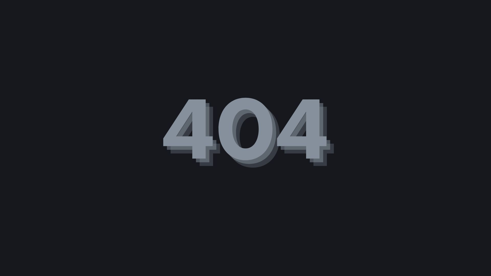

# Custom 404 Error Page

A simple and modern **404 Error Page** with a clean design and responsive layout.

## Features
- Minimalist and modern style
- Fully responsive design
- Smooth fade-in animations
- Interactive hover effect on the button

## Preview

## How to Use
1. Clone or download this repository.
2. Open `404.html` (or `index.html` if you renamed it) in your browser.
3. Customize text, styles, and images as needed.

## Technologies Used
- HTML5
- CSS3
- Google Fonts (Quicksand)

## Author
**Christian Wilhelm**  
[LinkedIn](https://www.linkedin.com/in/christian-wilhelm-8071802b2/)  
[GitHub](https://github.com/christianjws24)
